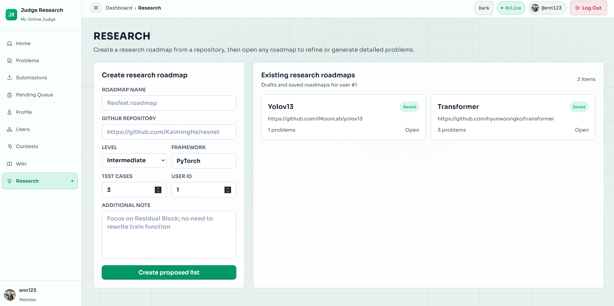

<div align="center">

# JudgeResearch Platform

AI-powered educational platform for programming problem creation, evaluation, and research.

JudgeResearch integrates automated judging, AI-assisted problem generation, code analysis, and research workflows into a unified web-based environment for instructors and learners.

<br>



<br>


</div>

---

## 🏗 System Architecture

JudgeResearch consists of three primary services:

| Service     | Purpose                                                                | Default Port |
| ----------- | ---------------------------------------------------------------------- | ------------ |
| Frontend    | User-facing web application                                            | `21080`      |
| Backend API | Authentication, evaluation engine, database access, and business logic | `21081`      |
| DeepWiki    | AI-powered research and documentation assistant                        | `21082`      |

---

## 📋 Prerequisites

Ensure the following software is installed before setup:

* Python 3.11+
* Node.js 18+
* npm
* Git
* Conda (optional)

---

# 🚀 Installation

## 1. Clone the Repository

```bash
git clone https://github.com/k19tvan/JudgeResearch.git
cd JudgeResearch
```

---

## 2. Backend Setup

### Create Virtual Environment

```bash
cd backend

python -m venv .venv
.venv/Scripts/Activate.ps1

pip install -r requirements.txt
```

### Initialize Database

```bash
python -m database.initialize_database
```

This command creates the SQLite database and initializes all required tables.

---

## 3. Frontend Setup

```bash
cd frontend

npm install
```

---

## 4. DeepWiki Setup

```bash
cd deepwiki-open

python -m venv .venv
.venv/Scripts/Activate.ps1

python -m pip install poetry==2.0.1

poetry install -C api

pip install dotenv grpcio faiss-cpu
```

Create an environment file:

```bash
cp env_example .env
```

Then configure your Gemini API key:

```env
GEMINI_API_KEY=your-api-key
```

---

# ⚙ Configuration

## Backend Environment

Create a backend environment file:

```bash
cp .env.example .env
```

Update required values:

```env
ADMIN_SECRET_KEY=your-secret-key
```

---

# ▶ Running the Platform

## Start Backend API

```bash
python -m uvicorn backend.main:app \
    --host 0.0.0.0 \
    --port 21081 \
    --reload
```

Backend endpoint:

```text
http://localhost:21081
```

---

## Start DeepWiki Service

Open a new terminal:

```bash
cd deepwiki-open

python -m api.main
```

DeepWiki endpoint:

```text
http://localhost:21082
```

---

## Start Frontend

Open another terminal:

```bash
cd frontend

npm run dev -- --host 0.0.0.0 --port 21080
```

Frontend application:

```text
http://localhost:21080
```

---

# 📂 Project Structure

```text
JudgeResearch/
├── backend/          # FastAPI backend
├── frontend/         # React frontend
├── deepwiki-open/    # AI research service
├── database/         # Database initialization and schema
├── images/           # Documentation assets
└── README.md
```

---

# ✨ Core Features

* AI-assisted programming problem generation
* Automated submission evaluation
* Test case generation and management
* Research-assisted problem authoring
* Draft session workflow
* User authentication and role management
* Interactive web-based dashboard

---

# 📄 License

This project is intended for educational and research purposes.
