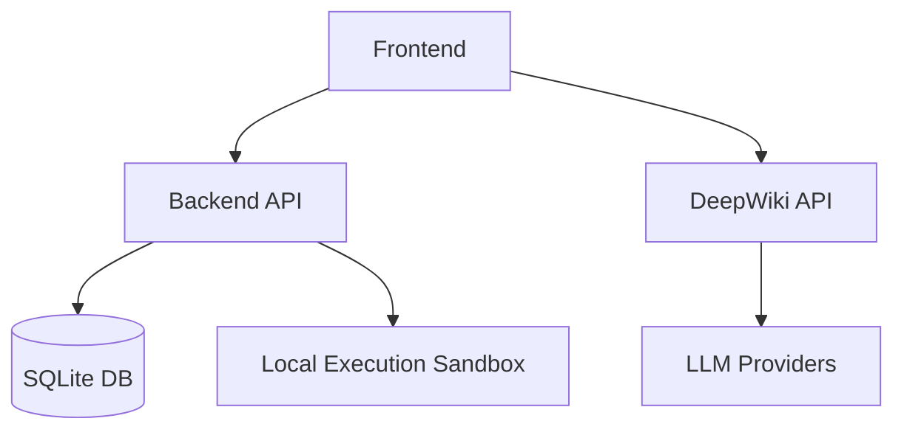

# JudgeResearch Knowledge Base

## Project Summary
- **Purpose**: A comprehensive educational problem management and research platform that combines AI-powered code analysis with interactive problem creation and evaluation.
- **Main features**: 
  - Standard algorithmic problem management
  - Live coding assessments
  - Intelligent wiki visualization through the DeepWiki submodule.
- **Tech stack**: Python (FastAPI), Node.js (React + Vite, Next.js), SQLite, LLMs (OpenAI, Ollama, etc.).
- **High-level architecture**: Distributed application separating standard problem-evaluation services from intensive AI repository parsing (DeepWiki). 

## Repository Map

### Backend Module
Responsible for API serving, authentication, code execution (sandbox), and file management.
- Documentation: [module_backend.md](modules/module_backend.md)
- Related files: [src_backend_main.md](files/src_backend_main.md), [src_backend_auth.md](files/src_backend_auth.md), [src_backend_sandbox.md](files/src_backend_sandbox.md), [src_backend_file_manager.md](files/src_backend_file_manager.md)

### Frontend Module
Responsible for the core React UI.
- Documentation: [module_frontend.md](modules/module_frontend.md)
- Related files: [src_frontend_App.md](files/src_frontend_App.md), [src_frontend_api.md](files/src_frontend_api.md), [src_frontend_components_Home.md](files/src_frontend_components_Home.md), [src_frontend_components_tabs_ProfileTab.md](files/src_frontend_components_tabs_ProfileTab.md), [src_frontend_components_tabs_UsersTab.md](files/src_frontend_components_tabs_UsersTab.md), [src_frontend_components_tabs_AccountManagementTab.md](files/src_frontend_components_tabs_AccountManagementTab.md)

### DeepWiki Module
Responsible for generative documentation over github repositories.
- Documentation: [module_deepwiki.md](modules/module_deepwiki.md)
- Related files: [src_deepwiki_api_main.md](files/src_deepwiki_api_main.md), [src_deepwiki_api_rag.md](files/src_deepwiki_api_rag.md), [src_deepwiki_frontend_page.md](files/src_deepwiki_frontend_page.md)

### Database Module
Responsible for standard relational storage structure state.
- Documentation: [module_database.md](modules/module_database.md)
- Related files: [src_database_initialize.md](files/src_database_initialize.md)

## Dependency Graph

## Quick Start For Future AI

"If you need to modify X, read these files first"

- **To modify User Auth**: 
  - [module_backend.md](modules/module_backend.md)
  - [src_backend_auth.md](files/src_backend_auth.md)
  - [src_backend_main.md](files/src_backend_main.md)
  - [src_frontend_components_Login.md](files/src_frontend_components_Login.md)

- **To modify Account Update / Profile Editing**:
  - [module_backend.md](modules/module_backend.md)
  - [module_frontend.md](modules/module_frontend.md)
  - [account_update_flow.md](workflows/account_update_flow.md)
  - [src_backend_main.md](files/src_backend_main.md)
  - [src_backend_auth.md](files/src_backend_auth.md)
  - [src_frontend_api.md](files/src_frontend_api.md)
  - [src_frontend_components_tabs_ProfileTab.md](files/src_frontend_components_tabs_ProfileTab.md)

- **To modify Admin Account Management**:
  - [module_backend.md](modules/module_backend.md)
  - [module_frontend.md](modules/module_frontend.md)
  - [admin_account_management_flow.md](workflows/admin_account_management_flow.md)
  - [src_backend_main.md](files/src_backend_main.md)
  - [src_frontend_api.md](files/src_frontend_api.md)
  - [src_frontend_components_Home.md](files/src_frontend_components_Home.md)
  - [src_frontend_components_tabs_AccountManagementTab.md](files/src_frontend_components_tabs_AccountManagementTab.md)

- **To modify DeepWiki LLM interactions**: 
  - [module_deepwiki.md](modules/module_deepwiki.md)
  - [src_deepwiki_api_rag.md](files/src_deepwiki_api_rag.md)

- **To modify Code Execution (Sandbox)**: 
  - [module_backend.md](modules/module_backend.md)
  - [src_backend_sandbox.md](files/src_backend_sandbox.md)

- **To modify Problem Files / Uploads**:
  - [module_backend.md](modules/module_backend.md)
  - [src_backend_file_manager.md](files/src_backend_file_manager.md)

- **To modify UI logic for JudgeResearch**: 
  - [module_frontend.md](modules/module_frontend.md)
  - [src_frontend_App.md](files/src_frontend_App.md)

- **To modify schema**: 
  - [module_database.md](modules/module_database.md)
  - [src_database_initialize.md](files/src_database_initialize.md)
