# D-FINE Architecture: Mermaid Flowcharts

Interactive flowcharts and state diagrams for D-FINE training pipeline.

---

## 1. Overall Training Loop

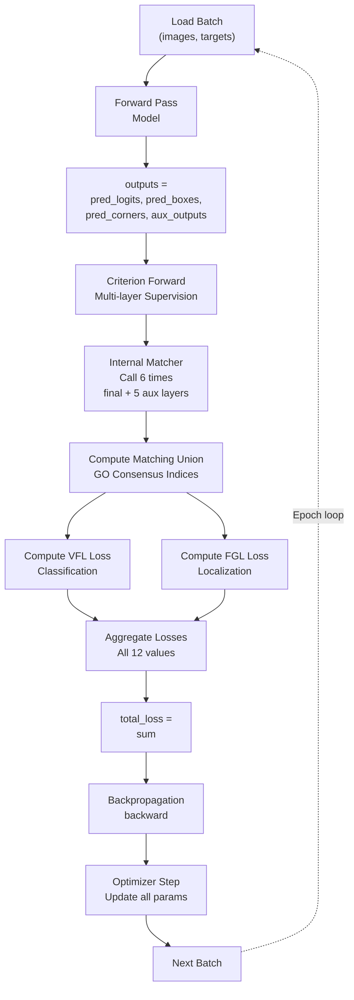

---

## 2. DFINECriterion Multi-Layer Flow

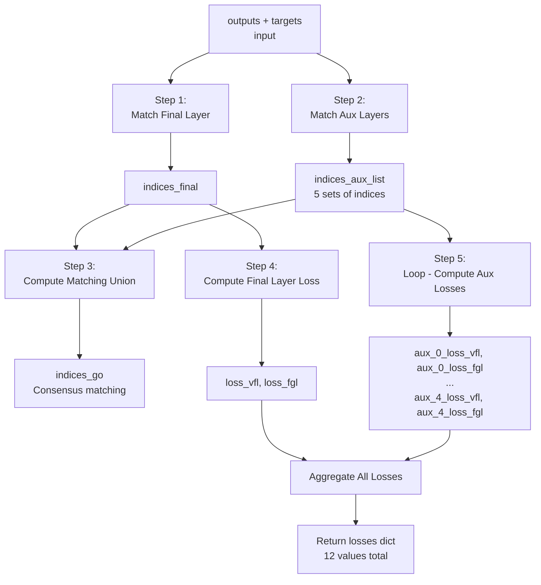

---

## 3. Matching Union Algorithm

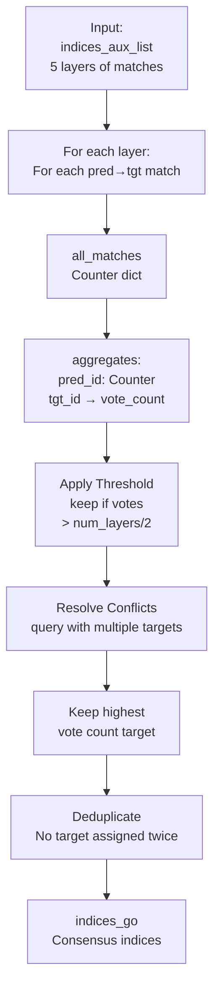

---

## 4. Model Forward: Decoder Layers

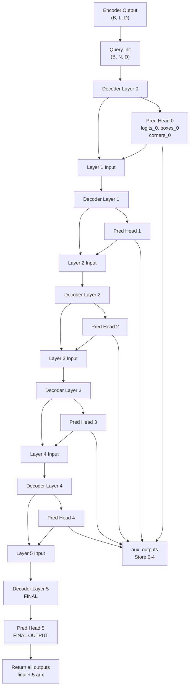

---

## 5. Matching Process: Single Layer

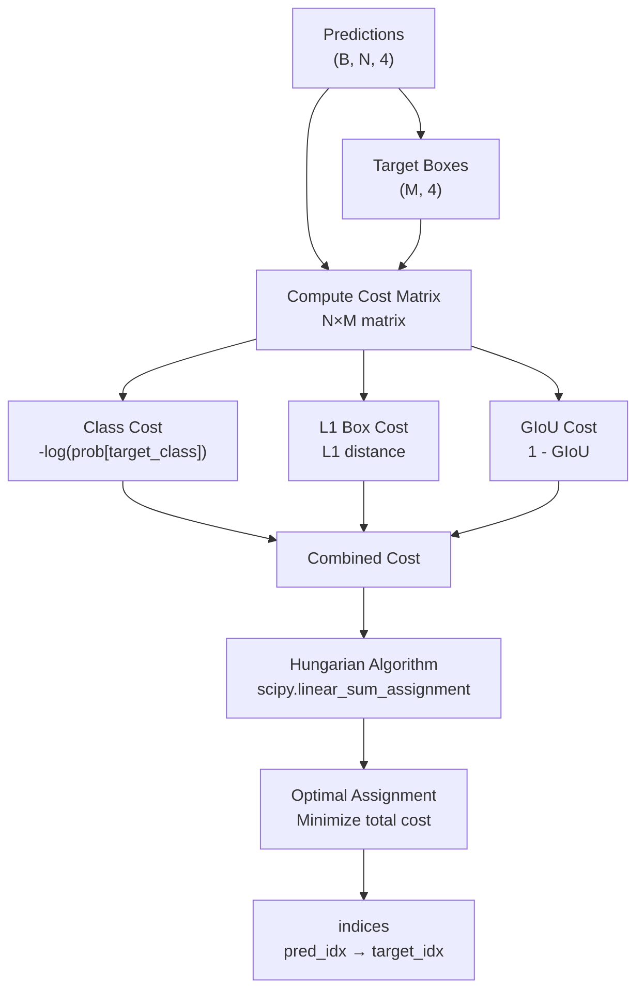

---

## 6. VFL Loss Computation

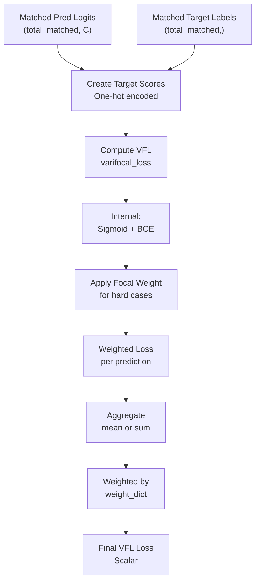

---

## 7. FGL Loss Computation

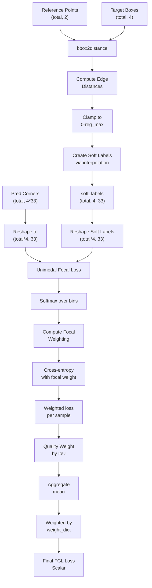

---

## 8. Gradient Flow Through Layers

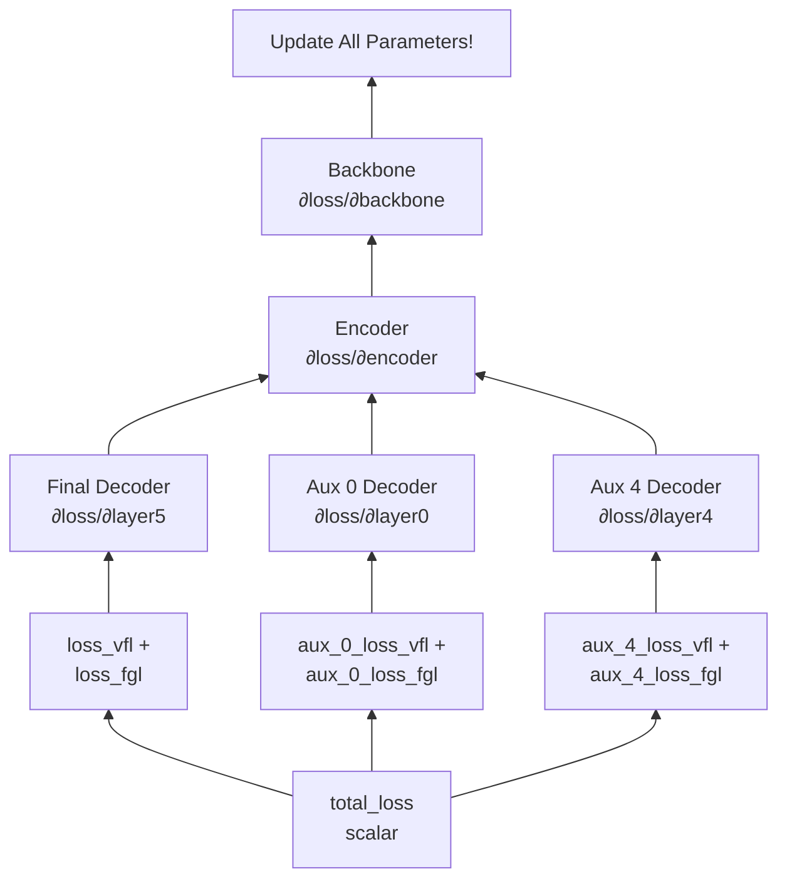

---

## 9. Output Dictionary Structure

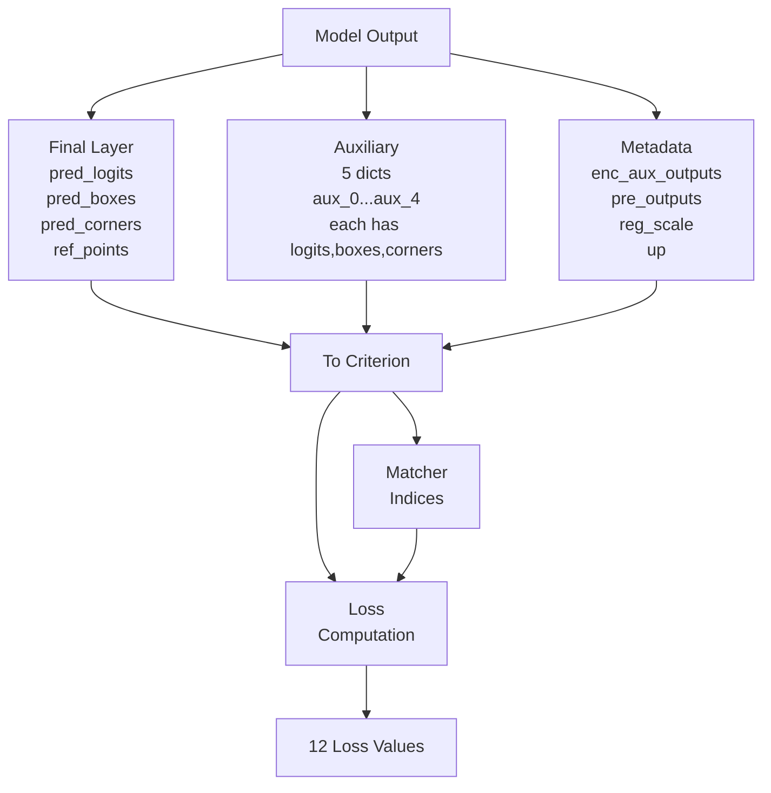

---

## 10. Multi-Layer Supervision Philosophy

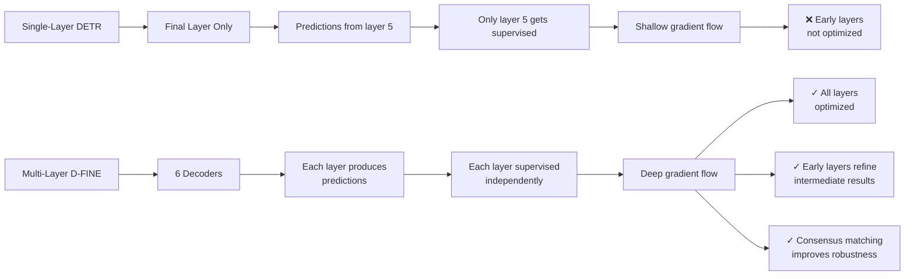

---

## 11. Data Flow: Batch Processing

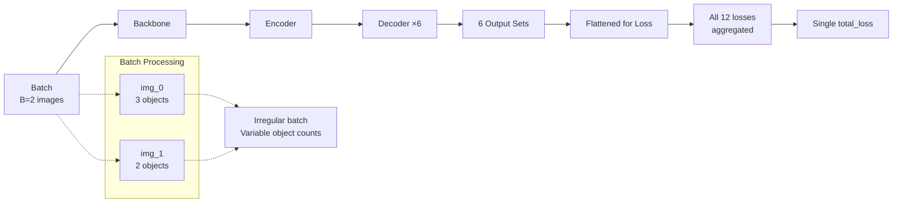

---

## 12. Tensor Shape Transformation

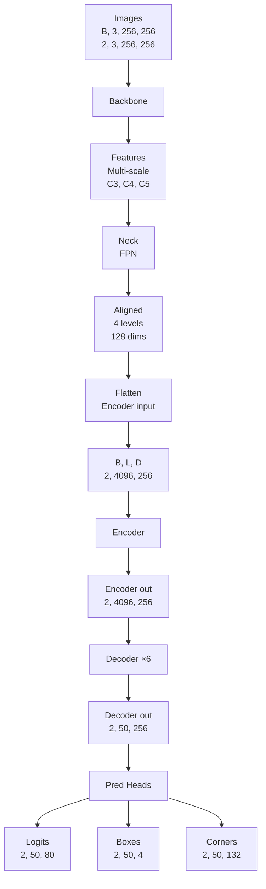

---

## Key Metrics & Notation

| Symbol | Meaning | Typical Value |
|--------|---------|---|
| **B** | Batch size | 2, 4, 8 |
| **N** | Number of queries | 50, 100 |
| **C** | Number of classes | 80 (COCO) |
| **D** | Model dimension | 256, 512 |
| **L** | Token length (H×W) | 4096 (64×64) |
| **M** | Number of ground truth objects | Variable (0-10+) |
| **reg_max** | FGL distance bins | 32 |
| **num_layers** | Decoder layers | 6 |
| **num_heads** | Attention heads | 8 |

---

These Mermaid diagrams provide interactive, easy-to-understand visualizations of the D-FINE architecture!
